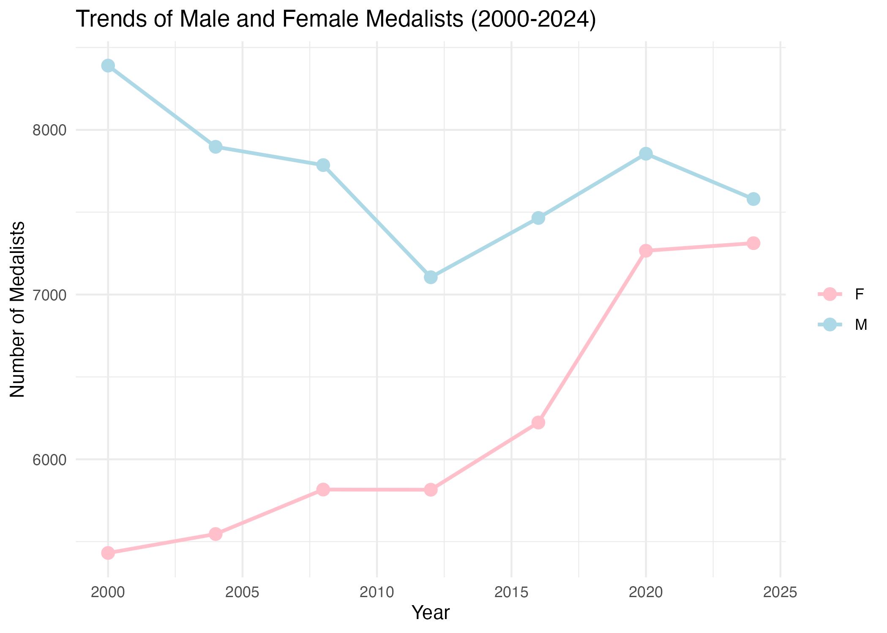

```{r table_one}
# Load necessary libraries
library(dplyr)

# Load the table_one object
table_one <- read_csv("output/gender_count.csv")

# Display table
gender_count
```

```{r}
# Load necessary library
library(ggplot2)

# Display the figure

```
